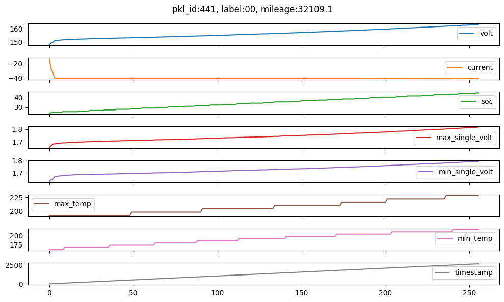
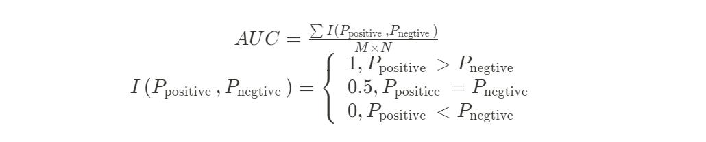
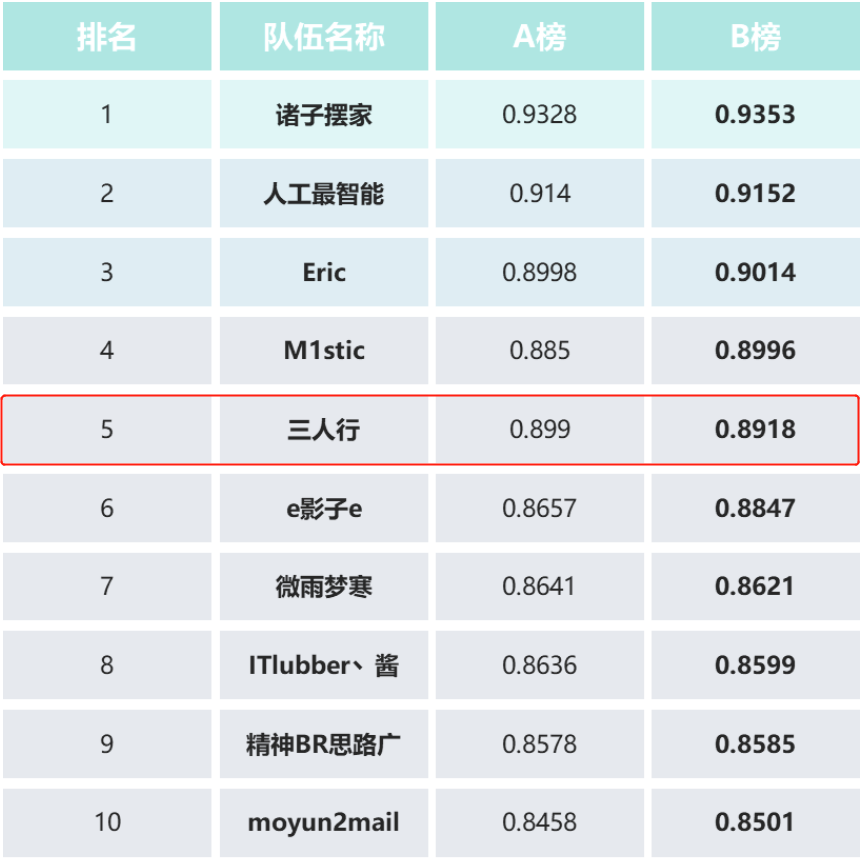

## 一、比赛简介

【**链接】**[https://aistudio.baidu.com/aistudio/competition/detail/495/0/introduction](https://aistudio.baidu.com/aistudio/competition/detail/495/0/introduction)

**【背景】** 新能源车辆电池的故障检测对于及时发现车辆问题、排除隐患、保护人的生命财产安全有着重要意义。新能源电池的故障是多种多样的，包括热失控、析锂、漏液等，本次比赛数据中包含了多种故障类型，但在数据中统一标注为故障标签“1”，不做进一步的区分。 一般故障检测都会面临故障标签少的问题，在本次比赛中，赛方对数据进行了筛选，使得正常数据和故障数据的比例不是非常悬殊，即便如此，常规的异常检测算法依然会是一个非常好的选择。  电池的数据是一种时序数据，在数据中的**‘timestamp’**列是该数据的时间戳，理解时序数据的处理方式可能会对异常检测有更好的效果。除此之外，发生异常的数据可能看起来很“正常”，需要提取更多的特征来进行分析。

**【数据】**本次比赛的数据集为经过处理的整车充电段数据，旨在借助充电数据分析车辆当前是否存在故障。比赛**选择了实际已发生电池故障，但传统的报警系统没有起到预警作用的数据**，数据为同一车型、多个车辆的混合数据，希望众多优秀选手通过机器学习等方法，找到有效识别车辆故障的模型。充电段数据是新能源车辆电池数据中比较稳定的数据，电池的参数变化也更有规律。需要注意的是，**比赛数据已经过清洗，数值的大小不能再反映电池本身的特性**，但数据变化的趋势仍然符合电池的规律，下图1是某一样本示意图。每个训练数据具有**256*8的时序数据**，其中一个为**时间戳**，此外还包含了**mileage和label**。



图1: 正常样本441的数据示意图

**【评价指标】：AUC** (area under curve) 是一个模型的评价指标，用于分类任务，被定义为ROC曲线下与坐标轴围成的面积，取值范围在0.5和1之间。AUC越接近1.0，检测方法真实性越高；等于0.5时，则真实性最低，无应用价值。这个指标想表达的含义是随机抽出一对样本（一个正样本，一个负样本），然后用训练得到的分类器来对这两个样本进行预测，预测得到正样本的概率大于负样本概率的概率。

AUC计算方法：通过直接统计预测label的逆序对数来实现，在有M个正样本，N个负样本的数据集里，一共有MN对样本，统计这MN对样本里，正样本的预测概率大于负样本预测概率的个数，计算公式如下：




## 二、团队方案


**【时间】** 2022年9月14日-2022年10月28日。

**【排名】 4** (A榜)/**5**(B榜)。

**【代码】** [nengwp/vloong-anomaly-detection-top5 (github.com)](https://github.com/nengwp/vloong-anomaly-detection-top5)


**【团队】** 团队 三人行 共三人：loving灬漠然丶Sqhttwl、Alvin.ai。

**【解说】** [vLoong新能源电池异常检测赛 第5名方案分享 (含其他前排方案)](https://mp.weixin.qq.com/s/GhAgG_tfEmf3k4Z3hKh4Aw)





### 1.特征工程

```python
'soc_min', 'max_temp_max', 'max_temp_min', 'current_mean',
'patv_mean', 'current_min', 'min_temp_max', 'ts_interval_std',
'max_temp_mean', 'soc_mean', 'soc_std', 'mileage',
'current_tnse1', 'patv_min', 'ts_interval_mean', 'min_temp_mean',
'milecls', 'current_tnse0', 'volt_tnse0', 
'ts_interval_outliers', 'volt_tnse1', 'min_temp_min', 'volt_std',
'ts_interval_min','min_single_volt_min','max_single_volt_max',
```

### 2.模型

我们使用**LightGBM方案。**为了避免模型过拟合，我们尽量的减少数的深度，**（设置为3）**，并且使用10折交叉验证的结果进行平均得到结果。具体参数如下：

```python
# 参数定义
params = {
    'task': 'train',
    'boosting_type': 'gbdt',
    'objective': 'binary',
    'metric': ['binary_logloss','auc'],
    'num_leaves':80,
    'max_depth':3, 
    'learning_rate': 0.1, 
    'feature_fraction': 0.4, 
    'num_threads':10,
    'bagging_fraction': 0.4,
    'bagging_freq': 5, 
    'lambda_l2':8.0,  
    'random_state':42,
    'min_gain_to_split':0.2,
    'verbose':-1
}
```

### 3.数据增强

我们本身对于时序数据没有进行额外的数据增强，我们对我们提取的特征进行数据增强，以提高模型的泛化能力。（该方法可提升约1%的AUC）

由于我们的任务是异常检测，而我们的方案采用的是有监督的二分类模型，因此我们仅对正常数据进行增强，对异常样本不做处理。我们使用**KMeansSMOTE**方法进行数据增强**。KMeansSMOTE使用KMeans对数据进行聚类，然后基于聚类类别进行数据合成，比较切合我们数据具有多种时序模式的情况。其参考代码如下：**

```python
from imblearn.over_sampling import *
ros = KMeansSMOTE(sampling_strategy={0:26108*10})
xtrain, ytrain = ros.fit_resample(xtrain, ytrain)
```

我们对正常样本进行10倍的数据增强，对于异常样本不进行增强。使用合成方法增强数据会对样本进行邻域采样，而异常样本的邻域往往多为正常样本（这也是异常检测的难点所在），因此对异常样本进行该增强会导致引入噪声使模型欠拟合而导致性能下降。
